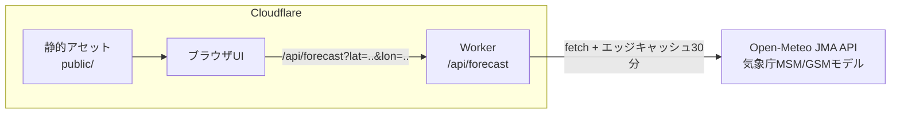

# FursuitWeather

着ぐるみ天気予報 - 気象データから着ぐるみ（ファースーツ）で活動するのに
適切かどうかを予報するWebサービスです。

## 概要

気象庁MSM/GSMモデル由来の気象データ（気温・湿度・日射量・風速）をもとに、
以下を予報します。

- **屋外活動指数**: 暑さ指数（WBGT）ベースの5段階判定
- **屋内活動指数**: 空調のない会場を想定した参考値と冷房要否（冷房必須/推奨/不要）
- **活動可能時間**: 1回あたりの連続活動時間の目安（60/45/30/15分/中止）
- **洗濯乾燥指数**: 洗濯物の乾きやすさ5段階と、ファースーツ全身洗いの乾燥時間目安

## 判定の仕組み

### 暑さ指数（WBGT）

環境省の熱中症予防情報サイトと同じ推定式（小野ら2014）で計算します。

```text
WBGT = 0.735×Ta + 0.0374×RH + 0.00292×Ta×RH
       + 7.619×SR − 4.557×SR² − 0.0572×WS − 4.064
（Ta: 気温℃、RH: 相対湿度%、SR: 全天日射量kW/m²、WS: 風速m/s）
```

着ぐるみの熱負荷は、厚生労働省「職場における熱中症予防基本対策要綱」の
WBGT着衣補正値（フード付き蒸気不透過つなぎ服 = +11℃）で補正し、
環境省の5段階（21/25/28/31℃）で判定します。

| 補正後WBGT | 判定 | 連続活動時間の目安 |
|-----------|----------|------------------|
| 21℃未満 | ほぼ安全 | 60分 |
| 21〜25℃ | 注意 | 45分 |
| 25〜28℃ | 警戒 | 30分 |
| 28〜31℃ | 厳重警戒 | 15分 |
| 31℃以上 | 危険 | 着用中止 |

気温15℃未満は推定式の適用範囲外のため、体感温度による低温判定
（0/-10/-20℃境界）に切り替え、汗冷え・凍結路面・凍傷などの注意を表示します。

### 洗濯乾燥指数

Tetensの式による飽和水蒸気圧から飽差（VPD）を求め、風速関数を掛けた
乾燥スピードを干し時間帯（9〜15時）で積算して0〜100に指数化します。
降水時は「外干しNG」、平均気温5℃未満は「乾きにくい（低温）」となります。

ファースーツの全身洗いは扇風機併用で24〜48時間の乾燥目安を表示し、
乾きにくい日はカビ警告を出します。乾燥機は熱でファーが傷むため使用禁止です。

## セットアップ

### 必要環境

- Node.js 22以上
- npm

### 手順

```bash
npm install
npm run dev
```

`http://localhost:8787` で動作確認できます。
気象APIに接続できない環境では `http://localhost:8787/?demo=1` で
デモデータの表示を確認できます。

### テスト・lint

```bash
npm test
npm run lint
```

## API

### GET /api/forecast

| パラメータ | 必須 | 説明 |
|-----------|------|--------------------------------|
| lat | ○ | 緯度（-90〜90） |
| lon | ○ | 経度（-180〜180） |
| days | - | 予報日数（1〜7、デフォルト4） |
| demo | - | `1`でデモデータを返す |

レスポンスは時間別予報（`hours`）と日別サマリー（`days`）を含むJSONです。

```bash
curl "https://<your-worker>/api/forecast?lat=35.6785&lon=139.6823"
```

## デプロイ

### 手動デプロイ

```bash
npx wrangler login
npm run deploy
```

### GitHub Actionsからのデプロイ

1. Cloudflareダッシュボードで「Edit Cloudflare Workers」テンプレートの
   APIトークンを作成する
1. リポジトリのSecretsに `CLOUDFLARE_API_TOKEN` と `CLOUDFLARE_ACCOUNT_ID` を
   設定する
1. Actionsタブから `Deploy` ワークフローを手動実行する

## アーキテクチャ



- 静的アセットは無料・無制限で配信され、Workerは `/api/*` のみ起動します
- 上流APIレスポンスはエッジで30分キャッシュし、Open-Meteoの
  無料枠レート制限（1万コール/日）を守ります

## データ出典・利用条件

- 気象データ: [Weather data by Open-Meteo.com](https://open-meteo.com/)
  （CC BY 4.0、気象庁MSM/GSMモデル由来、非商用利用）
- WBGT推定式: [環境省 熱中症予防情報サイト](https://www.wbgt.env.go.jp/)
- 着衣補正値: 厚生労働省「職場における熱中症予防基本対策要綱」

## 免責事項

本予報は目安であり、安全を保証するものではありません。
体調・装備・活動内容により安全な活動時間は変わります。
着ぐるみ活動は必ず2人以上で行い、体調の変化を感じたら直ちに中止してください。

## ライセンス

[Apache License 2.0](LICENSE)
