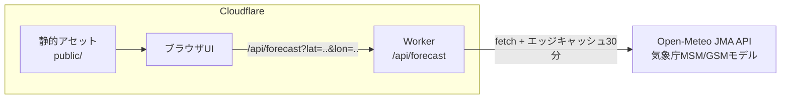
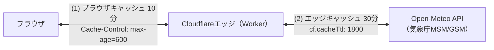

# FursuitWeather

着ぐるみ天気予報 - 気象データから着ぐるみ（fursuit）で活動するのに
適切かどうかを予報するWebサービスです。

公開URL: <https://fursuit-weather.223n.tech/>

## 概要

気象庁MSM/GSMモデル由来の気象データ（気温・湿度・日射量・風速）をもとに、
以下を予報します。

- **屋外活動指数**: 暑さ指数（WBGT）ベースの5段階判定
- **屋内活動指数**: 空調のない会場を想定した参考値と冷房要否（冷房必須/推奨/不要）
- **活動可能時間**: 1回あたりの連続活動時間の目安（60/45/30/15分/中止）
- **洗濯乾燥指数**: 洗濯物の乾きやすさ5段階と、着ぐるみ全身洗いの乾燥時間目安

## 判定の仕組み

### 暑さ指数（WBGT）

環境省の熱中症予防情報サイトと同じ推定式（小野ら2014）で計算します。

```text
WBGT = 0.735×Ta + 0.0374×RH + 0.00292×Ta×RH
       + 7.619×SR − 4.557×SR² − 0.0572×WS − 4.064
（Ta: 気温℃、RH: 相対湿度%、SR: 全天日射量kW/m²、WS: 風速m/s）
```

着ぐるみの熱負荷は、厚生労働省「職場における熱中症予防基本対策要綱」の
WBGT着衣補正値（フード付き蒸気不透過つなぎ服 = +11℃）で補正し、
環境省の5段階（21/25/28/31℃）で判定します。

| 補正後WBGT | 判定 | 連続活動時間の上限目安 |
|-----------|----------|----------------------|
| 21℃未満 | ほぼ安全 | 45分 |
| 21〜25℃ | 注意 | 30分 |
| 25〜28℃ | 警戒 | 20分 |
| 28〜31℃ | 厳重警戒 | 10分 |
| 31℃以上 | 危険 | 着用中止 |

連続活動時間は、自治体の着ぐるみ運用マニュアル（1回30分以内、夏季は
10〜20分）やイベントガイドなど（30〜45分で休憩）を参考に段階化した
上限の目安です。基本は「30分着たら30分休む」を推奨します。

参考資料:

- [さいたま市「着ぐるみ使用マニュアル」（PDF）](https://www.city.saitama.lg.jp/006/012/001/004/004/p010212_d/fil/kigurumi-m.pdf)
- [三原市「公式マスコットキャラクター使用に関するマニュアル」（PDF）](https://www.city.mihara.hiroshima.jp/uploaded/life/150268_522697_misc.pdf)
- [Anthrocon「Fursuiting in the Summer」](https://www.anthrocon.org/guides/fursuiting-in-the-summer/)
- [Melbourne Fur Con「Fursuiting Guidelines」](https://melbfurcon.com/fursuiting-guidelines/)

気温15℃未満では体感温度による低温判定（0/-10/-20℃境界）を併用し、
汗冷え・凍結路面・凍傷などの注意を表示します。着ぐるみは低温でも
発熱するため、暑熱判定と低温判定の深刻な方を採用します。

### 洗濯乾燥指数

Tetensの式による飽和水蒸気圧から飽差（VPD）を求め、風速関数を掛けた
乾燥スピードを干し時間帯（9〜15時）で積算して0〜100に指数化します。
降水時は「外干しNG」、平均気温5℃未満は「乾きにくい（低温）」となります。

> Tetensの式は「気温から、空気が抱えられる水蒸気の上限を求める式」です。
> 上限までの残り（飽差）が大きいほど洗濯物の水分が空気へ移りやすく、
> 「気温が高く、湿度が低く、風がある日ほどよく乾く」という経験則を
> そのまま計算式にしたものです。

着ぐるみの全身洗いは扇風機併用で24〜48時間の乾燥目安を表示し、
乾きにくい日はカビ警告を出します。乾燥機は熱でファーが傷むため使用禁止です。

## セットアップ

### 必要環境

- Node.js 22以上
- npm

### 手順

```bash
npm install
npm run dev
```

`http://localhost:8787` で動作確認できます。
気象APIに接続できない環境では `http://localhost:8787/?demo=1` で
デモデータの表示を確認できます。

### テスト・lint

```bash
npm test
npm run lint
```

## API

### GET /api/forecast

| パラメータ | 必須 | 説明 |
|-----------|------|--------------------------------|
| lat | ○ | 緯度（-90〜90） |
| lon | ○ | 経度（-180〜180） |
| days | - | 予報日数（1〜4、デフォルト4） |
| demo | - | `1`でデモデータを返す |

予報日数の上限は4日です（気象庁MSMの予報範囲。それ以降は日射量データが
なくWBGTを計算できないため）。

```bash
curl "https://fursuit-weather.223n.tech/api/forecast?lat=35.6785&lon=139.6823"
```

### レスポンスJSONの仕様

トップレベルのフィールドは以下のとおりです。

| フィールド | 型 | 説明 |
|--------------|----------|------------------------------------------|
| location | object | 予報地点（latitude・longitude・timezone） |
| generatedAt | string | レスポンス生成時刻（ISO 8601・UTC、例: `2026-08-15T09:00:00.000Z`） |
| model | string | 使用した気象モデル |
| attribution | object | データ出典表記（表示時は明記が必要） |
| notices | string[] | 通年の注意事項 |
| hours | array | 1時間ごとの予報 |
| days | array | 日別サマリー |

`hours[]`の各要素は`time`、`weather`（temperature・humidity・
apparentTemperature・precipitation・weatherCode・solarRadiation・
windSpeed）、`weatherLabel`、`outdoor`・`indoor`（判定オブジェクト）を
持ちます。判定オブジェクトは`wbgt`・`suitWbgt`（補正後WBGT）・`level`・
`label`・`grade`（0〜4）・`activityMinutes`・`advice`で構成され、
`indoor`にはさらに`cooling`（none/recommended/required）と
`coolingLabel`が加わります。

`days[]`の各要素は`date`、`temperatureMin`/`temperatureMax`、
`weatherCode`/`weatherLabel`、`outdoorWorst`/`outdoorBest`、
`recommendedHours`、`coolingRequired`、`laundry`（score・level・label・
fursuitDryingHours・moldWarning・advice）を持ちます。

詳細な仕様とレスポンス例は
[公開サイトの説明ページ](https://fursuit-weather.223n.tech/about)を
参照してください。フィールドの追加は後方互換として行うことがあるため、
未知のフィールドは無視してください。

## デプロイ

### 手動デプロイ

```bash
npx wrangler login
npm run deploy
```

### GitHub Actionsからのデプロイ

1. Cloudflareダッシュボードで「Edit Cloudflare Workers」テンプレートの
   APIトークンを作成する
1. リポジトリのSecretsに `CLOUDFLARE_API_TOKEN` と `CLOUDFLARE_ACCOUNT_ID` を
   設定する
1. mainブランチへのpushで自動デプロイされる（Actionsタブの `Deploy`
   ワークフローから手動実行も可能）

### カスタムドメイン

`wrangler.jsonc` の `routes` でカスタムドメイン
（`fursuit-weather.223n.tech`）を設定しています。デプロイ時に223n.techゾーンへ
DNSレコードとTLS証明書が自動作成されます。前提条件は以下のとおりです。

- 223n.techゾーンがデプロイ先と同じCloudflareアカウントにあること
- APIトークンにゾーン権限（「Edit Cloudflare Workers」テンプレートの
  「Workers Routes: 編集」）があること。最小権限トークンを使っている場合は
  「Zone > Workers Routes > 編集」（対象: 223n.tech）の追加が必要

## アーキテクチャ



- 静的アセットは無料・無制限で配信され、Workerは `/api/*` のみ起動します
- 上流APIレスポンスはエッジで30分キャッシュし、Open-Meteoの
  無料枠レート制限（1万コール/日）を守ります

### エッジ配信とキャッシュ

Workerは世界中に分散したCloudflareのデータセンター網（エッジ）のうち、
利用者に最も近い拠点で実行されます。予報データは2段階でキャッシュされます。



1. **エッジでの気象データキャッシュ（30分）**: 同じ地点・同じ日数の
   リクエストが30分以内に来た場合、Open-Meteoへは問い合わせず保存済みの
   コピーから応答します（`fetch`の`cf.cacheTtl`による。URL単位・
   データセンター単位で独立）
1. **ブラウザキャッシュ（10分）**: APIレスポンスの
   `Cache-Control: public, max-age=600`により、同じブラウザからの
   再リクエストは10分間キャッシュが再利用されます

表示される予報は最大で約40分前に取得されたものの可能性がありますが、
元データの気象庁MSMの更新は3時間ごとのため、実用上の影響はありません。
キャッシュ時間は`src/constants.ts`の`UPSTREAM_CACHE_TTL_SECONDS`と
`RESPONSE_CACHE_MAX_AGE_SECONDS`で調整できます。

## データ出典・利用条件

- 気象データ: [Weather data by Open-Meteo.com](https://open-meteo.com/)
  （CC BY 4.0、気象庁MSM/GSMモデル由来、非商用利用）
- WBGT推定式: [環境省 熱中症予防情報サイト](https://www.wbgt.env.go.jp/)
- 着衣補正値: 厚生労働省「職場における熱中症予防基本対策要綱」

## 免責事項

本予報は目安であり、安全を保証するものではありません。
体調・装備・活動内容により安全な活動時間は変わります。
着ぐるみ活動は必ず2人以上で行い、体調の変化を感じたら直ちに中止してください。

## ライセンス

[Apache License 2.0](LICENSE)
