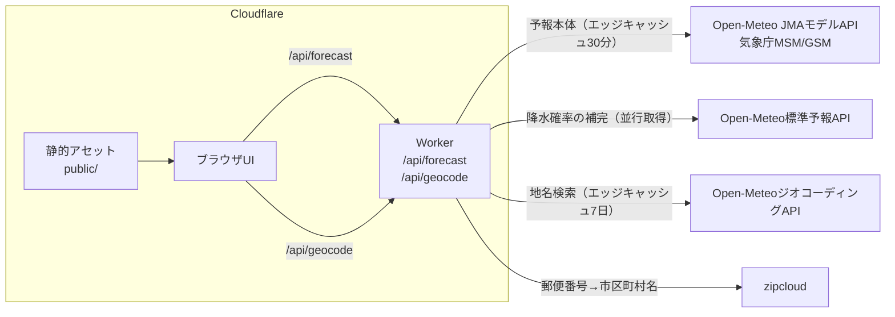
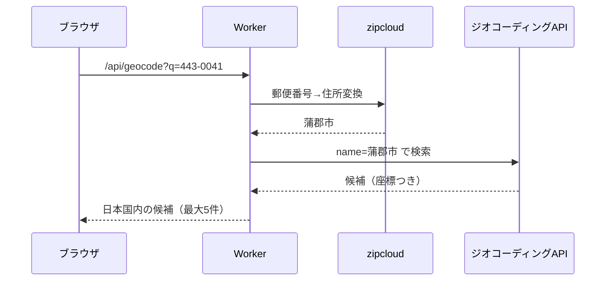
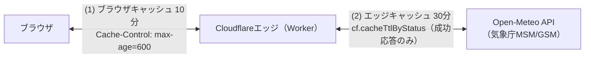

# アーキテクチャ

## システム構成

Cloudflare Workers上で動作します。静的アセット（UI）とWorker（API）の
2層構成で、Workerは予報系と地点検索系の2系統の上流へ問い合わせます。



- 静的アセットは無料・無制限で配信され、Workerは `/api/*` のみ起動します
  （`wrangler.jsonc` の `assets.run_worker_first` 設定による）
- 存在しないパスへのアクセスには`public/404.html`を404ステータスで
  返します（`assets.not_found_handling`設定による）
- セキュリティヘッダーは`public/_headers`で設定します
  （詳細は[開発ガイド](development.md)）
- 予報の上流はOpen-MeteoのJMAモデルAPI（`jma_seamless`）で、気象庁MSM
  （約5kmメッシュ・1時間粒度・4日先）のデータを取得します
- 降水確率のみ気象庁モデルAPIにないため、Open-Meteo標準予報APIから
  並行取得して補完します（取得失敗時も予報本体は成功させます）

## 地点検索の構成

地点検索（`/api/geocode`）は、ブラウザから外部APIへ直接アクセスさせず、
Workerが代理で問い合わせます。CSPを`connect-src 'self'`のまま維持し、
ブラウザの通信先を自サイトに限定するための設計です。

都市名はOpen-MeteoジオコーディングAPIで検索します。日本の郵便番号は
同APIで確実に引けないため、zipcloudで市区町村名へ変換してから地名で
検索する2段構成です。



- zipcloudの変換に失敗した場合や変換後の地名が0件の場合は、郵便番号の
  ままハイフンあり・なしの両形式で直接検索へフォールバックします
- 2文字以下の地名（「蒲郡」など）が0件のときは「市」「町」「村」「区」を
  順に補って再検索します（ジオコーディングAPIが2文字以下を完全一致で
  しか照合しないため）

## ソースコード構成

```text
src/
├── index.ts            Workerエントリポイント（ルーティング・最終防衛線）
├── csp.ts              HTMLページのCSP組み立てとnonce差し込み
├── api/
│   ├── forecast.ts     /api/forecast ハンドラ（検証・エラー応答）
│   ├── geocode.ts      /api/geocode ハンドラ（地点検索の代理問い合わせ）
│   └── http.ts         APIレスポンスの共通契約（CORS・キャッシュ・メソッドガード・502変換）
├── weather/
│   ├── openMeteo.ts    上流APIクライアント（取得・検証・変換）
│   ├── geocoding.ts    ジオコーディングAPIクライアント（都市名・郵便番号検索）
│   ├── upstream.ts     上流fetchの共通基盤（UA・エッジキャッシュ・タイムアウト・UpstreamError）
│   └── demoData.ts     デモデータ生成
├── logic/
│   ├── wbgt.ts         WBGT推定（小野2014式）
│   ├── fursuit.ts      着ぐるみ活動判定（暑熱・低温・冷房）
│   ├── laundry.ts      洗濯乾燥指数
│   ├── time.ts         時刻文字列の切り出しと時間帯フィルタ
│   └── forecast.ts     予報レスポンスの組み立て（純粋ロジック）
├── constants.ts        係数・しきい値の集約（出典コメント付き）
└── types.ts            共有型定義
public/                 静的アセット（HTML・CSS・JS・アイコン類）
├── events.json         イベント予報の定義（運営者が編集。開催地は郵便番号で指定。書き方はevents.md）
├── sw.js               Service Worker（オフライン表示。下記「オフライン表示」参照）
scripts/inline-css.mjs  ビルド時のCSSインライン化
test/                   vitestテスト
e2e/                    Playwright E2Eテスト（実ブラウザでの挙動検証）
```

- 判定ロジック（`src/logic/`）は純粋関数で構成し、IO（fetch）から
  分離しています
- 係数・しきい値は`src/constants.ts`に集約し、出典をコメントで明記します

## エラー処理方針

- 予期しない例外も`src/index.ts`の最終防衛線が捕捉し、CORSヘッダー付きの
  JSON（500）で返してAPI契約を守ります
- 上流APIの障害・タイムアウト・形式異常は`UpstreamError`として502に、
  パラメータの検証エラーは400に分類します
- 利用者へのエラーメッセージは固定の日本語文で、原因の詳細
  （英語のランタイム文言や上流レスポンス）はログにのみ残します。
  HTTPステータスも文面には出しません（利用者にとって意味がなく、対処の
  判断にも使えないため）。上流が5xxのときは「提供元で障害が発生しています」と
  待てば直ることが伝わる文面にし、それ以外とは区別します
  （`src/weather/upstream.ts`の`upstreamErrorMessage`）
- 上流への問い合わせには10秒のタイムアウトを設定し、上流の応答停滞に
  利用者のリクエストを道連れにしません
- 上流が5xxを返したときは一度だけ取り直します。Open-Meteo自身もCDNの
  背後にあり、CDNからオリジンへ到達できない数百ミリ秒の瞬断（HTTP 525）が
  実際に観測されました。取り直しの対象は5xxのみで、4xx（取り直しても
  同じ結果）とタイムアウト（待ち時間が二重になる）は対象外です
- 補助的な問い合わせはベストエフォートです。降水確率の取得失敗は
  `null`（「-」表示）に、zipcloudの失敗は郵便番号の直接検索への
  フォールバックになり、いずれも本体の応答を巻き込みません

## プライバシー設計

サーバー側に利用者のデータを持たない構成です。

- 現在地（GPS）の座標は、取得直後に小数2桁（約1km）へ丸めてから
  使います。予報は約5kmメッシュのため結果は変わらず、APIリクエストや
  共有URLに自宅を特定できる精度の位置が流れません
- 現在地はlocalStorageにもURLにも保存しません（「保存しません」の約束）
- 地点の記憶（最後に表示した地点）はブラウザのlocalStorageのみに保存し、
  サーバーへは送信しません
- 共有URL・記憶地点の座標もすべて小数2桁に統一しています
- `Permissions-Policy`で位置情報の利用を自サイトに限定しています

## セキュリティヘッダー

`public/_headers`で静的アセットの応答に付与します（契約は
`test/headers.test.ts`がCIで検証）。

| ヘッダー | 内容 |
|----------|------|
| `Content-Security-Policy` | `default-src 'none'`を基点に、必要な取得先だけを明示 |
| `Strict-Transport-Security` | `max-age=63072000; includeSubDomains; preload` |
| `Cross-Origin-Opener-Policy` | `same-origin`（オリジン分離） |
| `X-Content-Type-Options` | `nosniff` |
| `Referrer-Policy` | `strict-origin-when-cross-origin` |
| `Permissions-Policy` | 位置情報は自サイトのみ、カメラ・マイク・決済は禁止 |

HTMLページのCSPだけは`_headers`ではなくWorkerが付けます（次節）。
`_headers`のCSPは、JS・CSS・画像などのアセットと、Workerを通らない経路で
配信されるHTMLの保険として残しています。

CSPの要点は次のとおりです。

- **スクリプト**: HTMLページはnonce方式（次節）。アセット側の`_headers`は
  `script-src 'self'`。いずれも`'unsafe-eval'`は付けず、`'unsafe-inline'`も
  nonce/hashのある文脈でしか併記しません（nonce/hashが無い状態で書くと
  本当に有効化されてしまうため）
- **スタイル**: レンダリングブロック回避のためCSSをHTMLへインライン化して
  いるので、ビルド（`scripts/inline-css.mjs`）が埋め込むCSSのsha256を
  計算し、`_headers`のプレースホルダー`__INLINE_STYLE_HASH__`へ差し込みます。
  併記している`'unsafe-inline'`はハッシュを解釈できない古いブラウザ向けで、
  新しいブラウザでは無視されます。インラインの`style`属性はハッシュで
  許可できないため使いません（CSSクラスへ寄せています）
- **Trusted Types**: `require-trusted-types-for 'script'`でDOM型XSSの
  シンクを封じます。`ServiceWorkerContainer.register()`は
  `TrustedScriptURL`を要求するため、自分の`sw.js`以外を返さない専用
  ポリシー（`fursuitweather-sw`）を`public/app.js`が作ります。
  ポリシー名は`_headers`の`trusted-types`ディレクティブと一致させます

### HTMLページのnonce方式CSP

ホスト許可リスト（`script-src 'self'`）は「同一オリジンに置かれたJSなら
何でも実行できる」ことを意味し、許可リスト方式そのものが弱点として
指摘されます。HTMLページでは、リクエストごとに異なるnonceを発行して
「このページが載せたタグだけ」を実行できるようにしています。

```
script-src 'nonce-<毎回変わる値>' 'strict-dynamic' https: http: 'unsafe-inline'
style-src  'self' 'nonce-<同じ値>'
```

- Workerが`HTMLRewriter`で`script`・`style`タグへnonceを付け、同じ値を
  CSPヘッダーにも入れます（`src/csp.ts`の`withNonce`）
- `'strict-dynamic'`があるとホスト許可リストは無視されるため、外部
  スクリプト（アクセス解析）もHTML内のタグにnonceが付くことで読み込まれます
- JSON-LDは実行されないデータブロックのためnonceを付けません
- nonceは毎回変わるため、共有キャッシュに載らないよう`Cache-Control:
  no-store`を付けます

`script-src`の後半（`https:` `http:` `'unsafe-inline'`）は古いブラウザ向けの
後方互換です。ブラウザは解釈できない指定を読み飛ばすため、結果として
「解釈できる中で最も厳しい規則」が働きます。

| 環境 | 効く指定 |
|------|----------|
| `'strict-dynamic'`対応（CSP3） | nonce + `'strict-dynamic'`のみ。スキームと`'unsafe-inline'`は無視される |
| nonce対応・`'strict-dynamic'`非対応（CSP2） | nonce + `https:` `http:`。`'unsafe-inline'`はnonceがあるため無視される |
| nonce非対応（CSP1） | `https:` `http:` + `'unsafe-inline'`。nonceによる無効化が効かないため両方が通る |

`https:` `http:`はスキーム指定（scheme-source）で、`'self'`のような
ホスト指定より広く「httpsで配信されるスクリプトなら通す」という意味です。
CSP1しか解釈しない環境では、これと`'unsafe-inline'`が同時に効くため
実質素通りになりますが、その世代のブラウザはもともと`'strict-dynamic'`も
nonceも解釈できないので、併記の有無にかかわらず守れません。

併記しないと、`'strict-dynamic'`を解釈しない環境でnonce付きスクリプトが
動的に読み込むスクリプトが黙ってブロックされます。`http:`はCSP3・CSP2の
環境では無視されるか`upgrade-insecure-requests`でhttpsへ格上げされ、
そもそもHSTSにより平文では接続されません。並び順はCSPの意味を変えませんが、
段階が読み取れるよう厳しい順に書いています。

**nonceは必ずリクエストごとに変える必要があります。** HTMLに書かれた値は
攻撃者からも読めるため、固定値だと同じnonceを付けたタグを注入されて
突破されます。このため、HTMLは静的アセットとして配信せずWorkerを通します
（アセット配信は無料枠のリクエスト数を消費しないので、対象はHTMLだけに
絞っています）。

対象パスは`src/csp.ts`の`HTML_PATHS`と`wrangler.jsonc`の
`run_worker_first`の両方に書く必要があり、`test/csp.test.ts`が両者の
一致を検証します（ずれるとnonceの無いCSPで配信され、タグのnonceと
食い違って実行がブロックされます）。

### 外部スクリプト（アクセス解析）

読み込む外部スクリプトはCloudflare Web Analyticsの計測タグだけです。
CSPでは配信元と送信先のホストだけを名指しで許可します。

| 用途 | 許可 |
|------|------|
| 計測タグの読み込み | `script-src https://static.cloudflareinsights.com` |
| 計測データの送信 | `connect-src https://cloudflareinsights.com` |

`test/headers.test.ts`が、HTMLの`<script src>`とCSPの許可元が一致すること、
ワイルドカードが紛れ込んでいないことを検証します（ずれると計測タグが
黙ってブロックされます）。

### Cloudflare側の機能との関係

CSPを厳しくしているため、Cloudflareがページへ自動でスクリプトを差し込む
機能（Zaraz・Rocket Loaderなど）は動きません。差し込まれたスクリプトは
`script-src`の許可元に合致せず、`require-trusted-types-for`とも衝突します。
これらを使う場合はCSPの緩和が必要になるため、どちらを取るかを判断して
ください。アクセス解析は上記のとおりHTMLへ明示的に書いた計測タグで
行っており、Cloudflare側の自動挿入は前提にしていません（両方を有効に
すると二重計測になります）。

Zarazを有効にすると、ブラウザのコンソールに次のエラーが出ます。
いずれもZaraz側の問題で、当サイトのコードは関係ありません。
**Cloudflareダッシュボードの Zaraz を無効にすると解消します。**

```
TypeError: Failed to set the 'innerHTML' property on 'Element':
  This document requires 'TrustedHTML' assignment.  ... at window.zaraz._p
TypeError: Failed to set the 'src' property on 'HTMLScriptElement':
  This document requires 'TrustedScriptURL' assignment.  ... at zaraz.init
Executing inline script violates the following Content Security Policy
  directive 'script-src 'self' ... 'nonce-...''
```

3つ目は、Cloudflareが当サイトのCSPへ独自のnonceを追記しながら、
差し込んだインラインスクリプトの一部にそのnonceを付けていないために
起きます（自分で追記したCSPに自分で弾かれている状態）。CSPを緩めても
この不整合は当方では解消できません。

## Worker外向きfetchの525

上流APIが正常なのに、Workerからの`fetch`だけが**HTTP 525**（本文は
`error code: 525`）で失敗し続けることがあります。実際に2026-08-17に発生し、
約2時間サービスが停止しました。

**525はCloudflareのエッジと接続先オリジンの間のTLSハンドシェイク失敗**を表す
コードです。上流のアプリケーションまで到達していないので、上流のエラー応答
（Open-Meteoなら`{"error":true,"reason":...}`のJSON）とは別物です。

### 原因（実例）

`223n.tech`ゾーンのSSL/TLS設定「**配信元の接続**」の**ポスト量子暗号化**が
有効になっていたためでした。Cloudflareがポスト量子鍵交換でハンドシェイクを
試み、対応していない接続先（Open-MeteoのAPIはHetzner・netcupの自前サーバー）
との接続に失敗していました。

**ゾーンの設定なので、コードの変更では直りません。** 設定を戻した時点で
デプロイなしに即座に復旧します。

### 切り分け方（最初にこれをやる）

**同じWorkerをworkers.devサブドメインとカスタムドメインの両方から叩いて
比較します。** `wrangler.jsonc`の`workers_dev: true`はこのために有効に
してあります。

```bash
curl -s "https://fursuit-weather.223n.workers.dev/api/forecast?lat=35.68&lon=139.68&days=3"
curl -s "https://fursuit-weather.223n.tech/api/forecast?lat=35.68&lon=139.68&days=3"
```

| 結果 | 原因の所在 |
|------|-----------|
| workers.devは成功・カスタムドメインは失敗 | **ゾーン（223n.tech）の設定**。SSL/TLSの設定を見る |
| どちらも失敗 | 上流かコード。上流のURLをブラウザで直接開いて切り分ける |
| どちらも成功 | 復旧済み |

**同じコード・同じ上流URLで環境だけが違う**ため、1回の比較でコード側の
可能性をまとめて排除できます。上流やキャッシュを疑う前にこれを実行して
ください。

### 回り道した経緯（同じ轍を踏まないために）

このときは次の順で誤った仮説を立て、いずれも外れました。

1. 「上流の一時的な障害」→ 2時間続き、リトライも全敗で否定
2. 「こちらがエラー応答をキャッシュしている」→ エラーのTTLを0にしても再現
3. 「Cloudflare同士の内部経路の問題」→ **api.open-meteo.comはCloudflare配下
   ではなくHetznerだったので前提から誤り**

ログに残る情報（上流URL・ステータス・本文）だけでは、**どの区間で失敗して
いるか**が分かりません。ホスト名を変えて比較する切り分けを先に行えば、
最初の1回で範囲を半分にできました。

## エッジ配信

Workerは世界中に分散したCloudflareのデータセンター網（エッジ）のうち、
利用者に最も近い拠点で実行されます。特定のサーバー1台に集中しないため、
高速で障害にも強い構成です。

## キャッシュ設計

データの更新頻度に合わせて、予報と地点検索で正反対のキャッシュ設計を
採っています。

| 対象 | 上流へのエッジキャッシュ | 自レスポンスのブラウザキャッシュ |
|------|--------------------------|----------------------------------|
| 予報（/api/forecast） | 30分（`cf.cacheTtlByStatus`の200番台） | 10分（`Cache-Control: max-age=600`） |
| 地点検索（/api/geocode） | 7日（地名・郵便番号はほぼ不変） | なし（`no-store`） |

予報データは2段階でキャッシュされます。



1. エッジでの気象データキャッシュ（30分）: 同じ地点・同じ日数の
   リクエストが30分以内に来た場合、Open-Meteoへは問い合わせず保存済みの
   コピーから応答します（`fetch`の`cf.cacheTtlByStatus`による。URL単位・
   データセンター単位で独立）。データ提供元の無料枠
   （1日1万コール）を守る目的もあります
1. ブラウザキャッシュ（10分）: APIレスポンスの
   `Cache-Control: public, max-age=600`により、同じブラウザからの
   再リクエストは10分間キャッシュが再利用されます

表示される予報は最大で約40分前に取得されたものの可能性がありますが、
元データの気象庁MSMの更新は3時間ごとのため、実用上の影響はありません。

地点検索は逆に、上流の地名・郵便番号データがほぼ変化しないため
エッジで7日間キャッシュして無料枠を守ります。一方、自レスポンスは
`no-store`とし、検索ロジックの改善がデプロイ後すぐ全利用者へ反映される
ようにしています。

キャッシュされるのはURLをキーとした公開データ（気象データ・地名検索の
結果）のみです。現在地の座標などがほかの利用者と共有されることは
ありません。キャッシュ時間は`src/constants.ts`の
`UPSTREAM_CACHE_TTL_SECONDS`・`RESPONSE_CACHE_MAX_AGE_SECONDS`・
`GEOCODING_CACHE_TTL_SECONDS`で調整できます。

## オフライン表示（Service Worker）

PWAのService Worker（`public/sw.js`）が、オフライン時の表示を担います。

- **オンライン時は常にネットワーク優先**で、キャッシュは裏で更新する
  だけです（デプロイ後に古い画面を配らないための方針）
- オフライン時は、シェル（`SHELL_URLS`のHTML・JS・favicon・`events.json`。
  CSSはビルドでHTMLへインライン化済みのためHTML側に含まれる）と直近の予報
  （`DATA_CACHE`、上限10件）から応答します
- 保存済みの予報で応答するときは`X-Served-From-Cache`と`X-Cached-At`
  ヘッダーを付けます。これは`sw.js`と`public/app.js`
  （`cachedStatusText`・`displayedFromCache`）の間の契約で、フロントは
  これを使って「オフライン表示である旨と取得時刻」を利用者へ明示します

## 配信ドメイン

| ドメイン | 用途 |
|----------|------|
| `fursuit-weather.223n.tech` | 正規URL（カスタムドメイン。canonical・OGP・サイトマップはこちらを指す） |
| `fursuit-weather.223n.workers.dev` | workers.devサブドメイン。223n.techゾーンの設定（セキュリティ機能など）を経由しない検証用URL |

カスタムドメインは`wrangler.jsonc`の`routes`（`custom_domain: true`）で
設定し、デプロイ時にDNSレコードとTLS証明書が自動作成されます。
