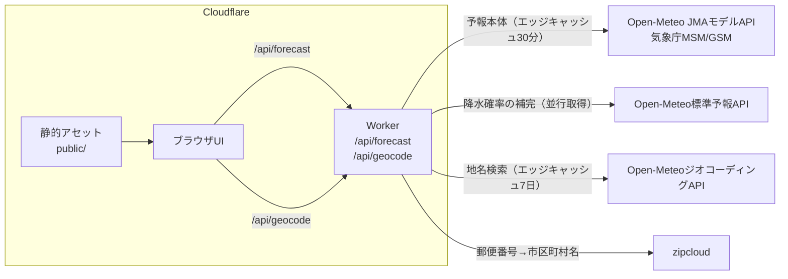
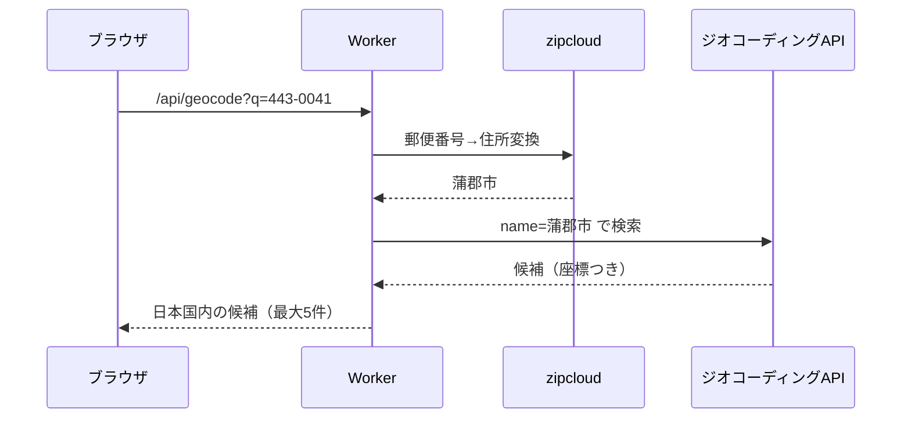
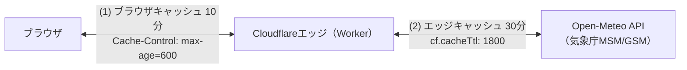

# アーキテクチャ

## システム構成

Cloudflare Workers上で動作します。静的アセット（UI）とWorker（API）の
2層構成で、Workerは予報系と地点検索系の2系統の上流へ問い合わせます。



- 静的アセットは無料・無制限で配信され、Workerは `/api/*` のみ起動します
  （`wrangler.jsonc` の `assets.run_worker_first` 設定による）
- 存在しないパスへのアクセスには`public/404.html`を404ステータスで
  返します（`assets.not_found_handling`設定による）
- セキュリティヘッダーは`public/_headers`で設定します
  （詳細は[開発ガイド](development.md)）
- 予報の上流はOpen-MeteoのJMAモデルAPI（`jma_seamless`）で、気象庁MSM
  （約5kmメッシュ・1時間粒度・4日先）のデータを取得します
- 降水確率のみ気象庁モデルAPIにないため、Open-Meteo標準予報APIから
  並行取得して補完します（取得失敗時も予報本体は成功させます）

## 地点検索の構成

地点検索（`/api/geocode`）は、ブラウザから外部APIへ直接アクセスさせず、
Workerが代理で問い合わせます。CSPを`connect-src 'self'`のまま維持し、
ブラウザの通信先を自サイトに限定するための設計です。

都市名はOpen-MeteoジオコーディングAPIで検索します。日本の郵便番号は
同APIで確実に引けないため、zipcloudで市区町村名へ変換してから地名で
検索する2段構成です。



- zipcloudの変換に失敗した場合や変換後の地名が0件の場合は、郵便番号の
  ままハイフンあり・なしの両形式で直接検索へフォールバックします
- 2文字以下の地名（「蒲郡」など）が0件のときは「市」「町」「村」「区」を
  順に補って再検索します（ジオコーディングAPIが2文字以下を完全一致で
  しか照合しないため）

## ソースコード構成

```text
src/
├── index.ts            Workerエントリポイント（ルーティング・最終防衛線）
├── api/
│   ├── forecast.ts     /api/forecast ハンドラ（検証・エラー応答）
│   └── geocode.ts      /api/geocode ハンドラ（地点検索の代理問い合わせ）
├── weather/
│   ├── openMeteo.ts    上流APIクライアント（取得・検証・変換）
│   ├── geocoding.ts    ジオコーディングAPIクライアント（都市名・郵便番号検索）
│   └── demoData.ts     デモデータ生成
├── logic/
│   ├── wbgt.ts         WBGT推定（小野2014式）
│   ├── fursuit.ts      着ぐるみ活動判定（暑熱・低温・冷房）
│   ├── laundry.ts      洗濯乾燥指数
│   └── forecast.ts     予報レスポンスの組み立て（純粋ロジック）
├── constants.ts        係数・しきい値の集約（出典コメント付き）
└── types.ts            共有型定義
public/                 静的アセット（HTML・CSS・JS・アイコン類）
├── events.json         イベント予報の定義（運営者が編集。開催地は郵便番号で指定。書き方はevents.md）
scripts/inline-css.mjs  ビルド時のCSSインライン化
test/                   vitestテスト
```

- 判定ロジック（`src/logic/`）は純粋関数で構成し、IO（fetch）から
  分離しています
- 係数・しきい値は`src/constants.ts`に集約し、出典をコメントで明記します

## エラー処理方針

- 予期しない例外も`src/index.ts`の最終防衛線が捕捉し、CORSヘッダー付きの
  JSON（500）で返してAPI契約を守ります
- 上流APIの障害・タイムアウト・形式異常は`UpstreamError`として502に、
  パラメータの検証エラーは400に分類します
- 利用者へのエラーメッセージは固定の日本語文で、原因の詳細
  （英語のランタイム文言や上流レスポンス）はログにのみ残します
- 上流への問い合わせには10秒のタイムアウトを設定し、上流の応答停滞に
  利用者のリクエストを道連れにしません
- 補助的な問い合わせはベストエフォートです。降水確率の取得失敗は
  `null`（「-」表示）に、zipcloudの失敗は郵便番号の直接検索への
  フォールバックになり、いずれも本体の応答を巻き込みません

## プライバシー設計

サーバー側に利用者のデータを持たない構成です。

- 現在地（GPS）の座標は、取得直後に小数2桁（約1km）へ丸めてから
  使います。予報は約5kmメッシュのため結果は変わらず、APIリクエストや
  共有URLに自宅を特定できる精度の位置が流れません
- 現在地はlocalStorageにもURLにも保存しません（「保存しません」の約束）
- 地点の記憶（最後に表示した地点）はブラウザのlocalStorageのみに保存し、
  サーバーへは送信しません
- 共有URL・記憶地点の座標もすべて小数2桁に統一しています
- `Permissions-Policy`で位置情報の利用を自サイトに限定しています

## エッジ配信

Workerは世界中に分散したCloudflareのデータセンター網（エッジ）のうち、
利用者に最も近い拠点で実行されます。特定のサーバー1台に集中しないため、
高速で障害にも強い構成です。

## キャッシュ設計

データの更新頻度に合わせて、予報と地点検索で正反対のキャッシュ設計を
採っています。

| 対象 | 上流へのエッジキャッシュ | 自レスポンスのブラウザキャッシュ |
|------|--------------------------|----------------------------------|
| 予報（/api/forecast） | 30分（`cf.cacheTtl: 1800`） | 10分（`Cache-Control: max-age=600`） |
| 地点検索（/api/geocode） | 7日（地名・郵便番号はほぼ不変） | なし（`no-store`） |

予報データは2段階でキャッシュされます。



1. エッジでの気象データキャッシュ（30分）: 同じ地点・同じ日数の
   リクエストが30分以内に来た場合、Open-Meteoへは問い合わせず保存済みの
   コピーから応答します（`fetch`の`cf.cacheTtl`による。URL単位・
   データセンター単位で独立）。データ提供元の無料枠
   （1日1万コール）を守る目的もあります
1. ブラウザキャッシュ（10分）: APIレスポンスの
   `Cache-Control: public, max-age=600`により、同じブラウザからの
   再リクエストは10分間キャッシュが再利用されます

表示される予報は最大で約40分前に取得されたものの可能性がありますが、
元データの気象庁MSMの更新は3時間ごとのため、実用上の影響はありません。

地点検索は逆に、上流の地名・郵便番号データがほぼ変化しないため
エッジで7日間キャッシュして無料枠を守ります。一方、自レスポンスは
`no-store`とし、検索ロジックの改善がデプロイ後すぐ全利用者へ反映される
ようにしています。

キャッシュされるのはURLをキーとした公開データ（気象データ・地名検索の
結果）のみです。現在地の座標などがほかの利用者と共有されることは
ありません。キャッシュ時間は`src/constants.ts`の
`UPSTREAM_CACHE_TTL_SECONDS`・`RESPONSE_CACHE_MAX_AGE_SECONDS`・
`GEOCODING_CACHE_TTL_SECONDS`で調整できます。

## 配信ドメイン

| ドメイン | 用途 |
|----------|------|
| `fursuit-weather.223n.tech` | 正規URL（カスタムドメイン。canonical・OGP・サイトマップはこちらを指す） |
| `fursuit-weather.223n.workers.dev` | workers.devサブドメイン。223n.techゾーンの設定（セキュリティ機能など）を経由しない検証用URL |

カスタムドメインは`wrangler.jsonc`の`routes`（`custom_domain: true`）で
設定し、デプロイ時にDNSレコードとTLS証明書が自動作成されます。
