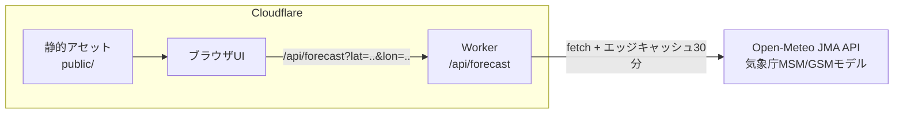
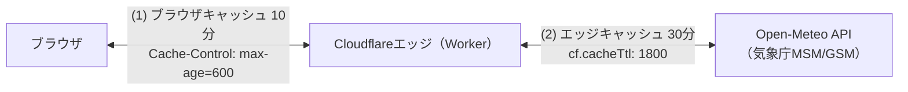

# アーキテクチャ

## システム構成

Cloudflare Workers上で動作します。静的アセット（UI）とWorker（API）の
2層構成です。



- 静的アセットは無料・無制限で配信され、Workerは `/api/*` のみ起動します
  （`wrangler.jsonc` の `assets.run_worker_first` 設定による）
- 存在しないパスへのアクセスには`public/404.html`を404ステータスで
  返します（`assets.not_found_handling`設定による）
- セキュリティヘッダーは`public/_headers`で設定します
  （詳細は[開発ガイド](development.md)）
- 上流はOpen-MeteoのJMAモデルAPI（`jma_seamless`）で、気象庁MSM
  （約5kmメッシュ・1時間粒度・4日先）のデータを取得します
- 降水確率のみ気象庁モデルAPIにないため、Open-Meteo標準予報APIから
  並行取得して補完します（取得失敗時も予報本体は成功させます）

## ソースコード構成

```text
src/
├── index.ts            Workerエントリポイント（ルーティング・最終防衛線）
├── api/
│   ├── forecast.ts     /api/forecast ハンドラ（検証・エラー応答）
│   └── geocode.ts      /api/geocode ハンドラ（地点検索の代理問い合わせ）
├── weather/
│   ├── openMeteo.ts    上流APIクライアント（取得・検証・変換）
│   ├── geocoding.ts    ジオコーディングAPIクライアント（都市名・郵便番号検索）
│   └── demoData.ts     デモデータ生成
├── logic/
│   ├── wbgt.ts         WBGT推定（小野2014式）
│   ├── fursuit.ts      着ぐるみ活動判定（暑熱・低温・冷房）
│   ├── laundry.ts      洗濯乾燥指数
│   └── forecast.ts     予報レスポンスの組み立て（純粋ロジック）
├── constants.ts        係数・しきい値の集約（出典コメント付き）
└── types.ts            共有型定義
public/                 静的アセット（HTML・CSS・JS・アイコン類）
scripts/inline-css.mjs  ビルド時のCSSインライン化
test/                   vitestテスト
```

- 判定ロジック（`src/logic/`）は純粋関数で構成し、IO（fetch）から
  分離しています
- 係数・しきい値は`src/constants.ts`に集約し、出典をコメントで明記します

## エッジ配信

Workerは世界中に分散したCloudflareのデータセンター網（エッジ）のうち、
利用者に最も近い拠点で実行されます。特定のサーバー1台に集中しないため、
高速で障害にも強い構成です。

## 2段階キャッシュ

予報データは2段階でキャッシュされます。



1. エッジでの気象データキャッシュ（30分）: 同じ地点・同じ日数の
   リクエストが30分以内に来た場合、Open-Meteoへは問い合わせず保存済みの
   コピーから応答します（`fetch`の`cf.cacheTtl`による。URL単位・
   データセンター単位で独立）。データ提供元の無料枠
   （1日1万コール）を守る目的もあります
1. ブラウザキャッシュ（10分）: APIレスポンスの
   `Cache-Control: public, max-age=600`により、同じブラウザからの
   再リクエストは10分間キャッシュが再利用されます

表示される予報は最大で約40分前に取得されたものの可能性がありますが、
元データの気象庁MSMの更新は3時間ごとのため、実用上の影響はありません。
キャッシュされるのは公開の気象データのみで、現在地の座標などが
ほかの利用者と共有されることはありません。

キャッシュ時間は`src/constants.ts`の`UPSTREAM_CACHE_TTL_SECONDS`と
`RESPONSE_CACHE_MAX_AGE_SECONDS`で調整できます。

## 配信ドメイン

| ドメイン | 用途 |
|----------|------|
| `fursuit-weather.223n.tech` | 正規URL（カスタムドメイン。canonical・OGP・サイトマップはこちらを指す） |
| `fursuit-weather.223n.workers.dev` | workers.devサブドメイン。223n.techゾーンの設定（セキュリティ機能など）を経由しない検証用URL |

カスタムドメインは`wrangler.jsonc`の`routes`（`custom_domain: true`）で
設定し、デプロイ時にDNSレコードとTLS証明書が自動作成されます。
