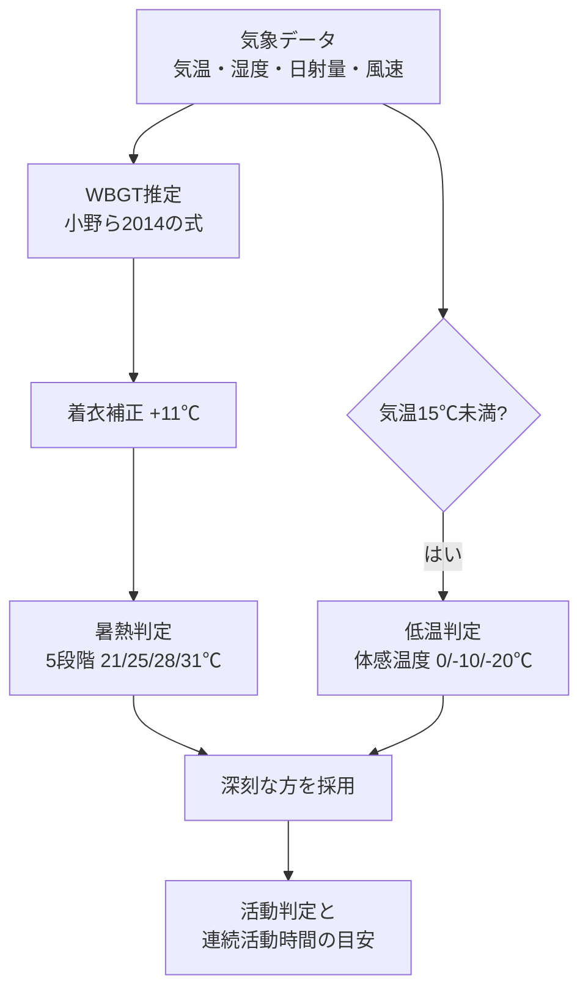

# 判定ロジック

着ぐるみ活動の適否を判定する仕組みと、その根拠を説明します。
実装は `src/logic/` 配下にあり、係数・しきい値は出典コメント付きで
`src/constants.ts` に集約しています。

処理の流れは次のとおりです。



## 暑さ指数（WBGT）

環境省の熱中症予防情報サイトと同じ推定式（小野ら2014）で計算します。

```text
WBGT = 0.735×Ta + 0.0374×RH + 0.00292×Ta×RH
       + 7.619×SR − 4.557×SR² − 0.0572×WS − 4.064
（Ta: 気温℃、RH: 相対湿度%、SR: 全天日射量kW/m²、WS: 風速m/s）
```

- 実装: `src/logic/wbgt.ts`
- 夜間の負の日射量は0に丸めます
- 屋内は日射量0・風速0.5m/s（日本生気象学会の室内想定風速）で同じ式を使います

## 着ぐるみの着衣補正

着ぐるみの熱負荷は、厚生労働省「職場における熱中症予防基本対策要綱」
（ISO 7243:2017準拠）のWBGT着衣補正値を使い、
「フード付き蒸気不透過つなぎ服」に相当する+11℃で補正します。

WBGTと補正後WBGTはいずれも小数1桁へ丸めた値で判定します
（実装: `src/logic/fursuit.ts`、丸めは`src/logic/wbgt.ts`の`roundWbgt`）。

## 屋外判定

暑熱判定と低温判定の2系統で評価し、深刻な方を採用します。

### 暑熱側の5段階判定

補正後WBGTを環境省の5段階（21/25/28/31℃）で判定します。

| 補正後WBGT | 判定 | 連続活動時間の上限目安 |
|-----------|----------|----------------------|
| 21℃未満 | ほぼ安全 | 45分 |
| 21〜25℃ | 注意 | 30分 |
| 25〜28℃ | 警戒 | 20分 |
| 28〜31℃ | 厳重警戒 | 10分 |
| 31℃以上 | 危険 | 着用中止 |

境界値は上の段階に入ります（例: 丸め後ちょうど25.0℃は「警戒」）。
連続活動時間は、自治体の着ぐるみ運用マニュアル（1回30分以内、夏季は
10〜20分）やイベントガイドなど（30〜45分で休憩）を参考に段階化した
上限の目安です。基本は「30分着たら30分休む」を推奨します。
出典は[参考資料](references.md)を参照してください。

### 低温側の判定

気温15℃未満では、体感温度による低温判定を併用し、
汗冷え・凍結路面・凍傷などの注意を表示します。

| 体感温度 | 判定 | 連続活動時間の上限目安 |
|----------|----------|----------------------|
| 0℃以上 | 快適 | 45分 |
| -10〜0℃ | 低温注意 | 45分 |
| -20〜-10℃ | 低温警戒 | 30分 |
| -20℃未満 | 低温危険 | 着用中止 |

15℃という切り替え境界は、WBGT推定式（小野ら2014）が夏季日中の観測
データへの回帰式であり、低温域では推定精度が落ちるためです
（しきい値は`src/constants.ts`の`COLD_SWITCH_TEMPERATURE`）。

### 暑熱と低温の合成

着ぐるみは低温でも発熱するため、低温域でも暑熱判定を捨てません。
着衣補正+11℃により、日射の強い10℃台でも暑熱側が警戒帯に入ることが
あります。低温判定だけに切り替えると危険側の誤判定（快適・長時間OK）に
なるため、深刻度（grade）が大きい方、同じ深刻度なら連続活動時間が
短い方を採用します（実装: `src/logic/fursuit.ts` の `assessOutdoor`）。

## 屋内判定と冷房要否

屋内は日射なし・微風（空調のない会場で室温が外気温と同程度になる場合）を
想定した参考値です。着ぐるみ補正後のWBGTで判定します。

| 補正後WBGT | 冷房要否 |
|-----------|----------|
| 25℃以上 | 冷房必須 |
| 21℃以上 | 冷房推奨 |
| 21℃未満 | 冷房なしでも可 |

しきい値は暑熱5段階の「警戒」帯（25℃）と「注意」帯（21℃）の境界に
対応します。低温域の屋内は暖房・無風で穏やかになるため、
低温判定は行いません。

トップページの「実測WBGT」タブは、WBGT計の実測値に同じ
着衣補正（+11℃）を加え、同じ5段階と冷房しきい値で判定します。
推定式をスキップするだけで、判定基準は本ドキュメントと共通です
（実装: `public/wbgt-tool.js`。しきい値の同期は`test/htmlSync.test.ts`が
機械検証します）。

## 日別サマリー

日別カードの表示は、時間別判定を日単位に要約したものです
（実装: `src/logic/forecast.ts` の `buildDayForecast`）。

- 要約の対象は日中（9〜18時）の時間帯です。日中のデータがない日
  （取得初日の夜間のみなど）は全時間帯で代替します
- 「最も厳しい判定」「最も穏やかな判定」は、対象時間帯の深刻度の
  最大・最小です
- 活動推奨時間帯は、日中のうち深刻度1（注意）以下かつ降水量が0の
  時間です
- 冷房必須フラグは、対象時間帯に屋内判定「冷房必須」の時間が
  1つでもあるかを示します
- 代表天気は、正午に最も近い時刻の天気コードです
- 素のWBGT（着衣補正前）の日最大値も集計します。33以上は環境省・
  気象庁の熱中症警戒アラートの発表基準に相当するため、画面の注意事項欄に
  公式の発表状況（[環境省 熱中症予防情報サイト](https://www.wbgt.env.go.jp/alert.php)）
  への導線つきで注意を表示します
- 最大風速（1時間平均の最大）も集計します。日中に限らず全時間帯から
  取ります（夜間の設営・撤収時の強風も安全に関わるため）

## 風・雷・急な暑さの注意表示

WBGTの判定とは別に、次の条件で画面の注意事項欄に注意を表示します。

- 強風: 日別の最大風速が10m/s以上の日（気象庁の風の強さの表現で
  「やや強い風」以上）。瞬間風速は平均の1.5〜3倍程度になることがある
  ため、看板・テントなど設営物の固定とヘッド着用時の視界への注意を
  促します
- 雷: 予報に雷を伴う天気（WMOコード95以上）がある日。屋外活動の中止と
  建物内への避難を促します。雷の表示がないことは雷が発生しないことを
  保証しません（予報があるときだけ注意を出す片方向の表示です）
- 急な暑さ（暑熱順化前）: 予報初日の最高気温が直近7日の平均最高気温を
  5℃以上上回り、かつ最高気温が25℃以上の場合
  （実装: `src/logic/acclimatization.ts`、APIレスポンスの`suddenHeat`）。
  体が暑さに慣れていない時期の急な気温上昇は、WBGTの値が同じでも
  熱中症の危険が高まるため、着用時間の短縮と休憩の追加を促します
  （日本生気象学会「日常生活における熱中症予防指針」の考え方を目安に
  採用）。比較対象に数えるのは1日あたり12時間分以上のデータがある日だけで
  （部分欠測の日は平均を歪めるため除外）、過去データが5日分未満のときは
  判定せず`null`を返します

## 降水の扱い

判定に使うのは降水量（mm）で、降水確率は使いません。

- 活動推奨時間帯は降水量0の時間だけが対象です
- 洗濯乾燥指数の「降水時」は、干し時間帯に降水量が0を超える時間が
  1つでもある場合です
- 降水確率は表示専用の補完値です。気象庁モデルAPIが提供しないため
  Open-Meteo標準予報APIから取得し、取得できない時間は「-」表示に
  なります（判定結果には影響しません）

## 洗濯乾燥指数

Tetensの式による飽和水蒸気圧から飽差（VPD）を求め、風速関数を掛けた
乾燥スピードを干し時間帯（9〜15時）で積算して0〜100に指数化します
（実装: `src/logic/laundry.ts`）。

```text
es(T) = 6.1078 × 10^(7.5T / (T + 237.3))   … 飽和水蒸気圧（hPa）
VPD   = es × (1 − 湿度 / 100)              … 飽差
D     = VPD × (1 + 0.225 × 風速)           … 1時間あたりの乾燥スピード
```

> Tetensの式は「気温から、空気が抱えられる水蒸気の上限を求める式」です。
> 上限までの残り（飽差）が大きいほど洗濯物の水分が空気へ移りやすく、
> 「気温が高く、湿度が低く、風がある日ほどよく乾く」という経験則を
> そのまま計算式にしたものです。

- 段階分けはtenki.jp洗濯指数の5段階に準拠します
- 降水時は「外干しNG（雨）」、平均気温5℃未満は「乾きにくい（低温）」に
  なります。降水時はレベルだけでなく指数も0に固定し、その値から
  乾燥目安時間とカビ警告を計算します
- 欠測で干し時間帯のデータが6時間に満たない場合も指数が偏らないよう、
  時間平均をフル時間帯（6時間）換算してから正規化します
- 干し時間帯のデータが1件もない場合（当日の夕方以降にアクセスした
  場合など）は判定不能として最低評価を返します（指数0・部屋干し推奨・
  カビ警告と「判定できません」の注意文）

## 着ぐるみの乾燥目安

着ぐるみの全身洗いは、扇風機併用で24〜48時間の乾燥目安を指数から
線形補間して表示します。指数30未満の日はカビ警告
（48時間以内に乾き切らない恐れ）を出します。
乾燥機は熱でファーが傷むため、熱なし設定でも使用禁止としています。
